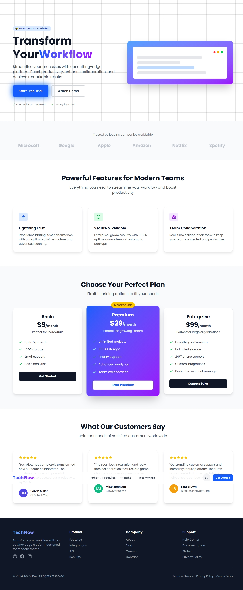
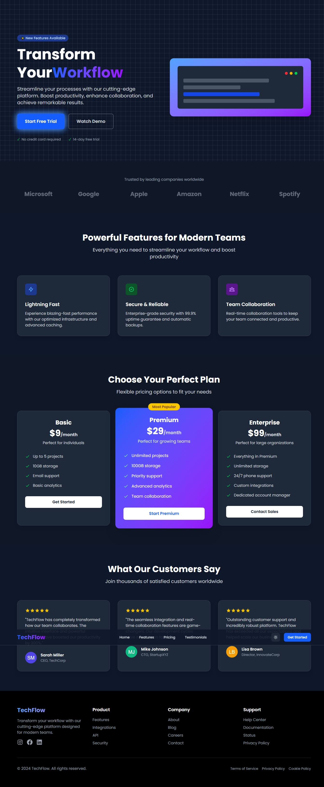

# React + Vite + Tailwind

This template provides a minimal setup to get React working in Vite with HMR and some ESLint rules.

Currently, two official plugins are available:

- [@vitejs/plugin-react](https://github.com/vitejs/vite-plugin-react/blob/main/packages/plugin-react) uses [Babel](https://babeljs.io/) for Fast Refresh
- [@vitejs/plugin-react-swc](https://github.com/vitejs/vite-plugin-react/blob/main/packages/plugin-react-swc) uses [SWC](https://swc.rs/) for Fast Refresh

## Expanding the ESLint configuration

If you are developing a production application, we recommend using TypeScript with type-aware lint rules enabled. Check out the [TS template](https://github.com/vitejs/vite/tree/main/packages/create-vite/template-react-ts) for information on how to integrate TypeScript and [`typescript-eslint`](https://typescript-eslint.io) in your project.

## 🌓 Light and Dark Mode Previews

### ✨ Light Mode


### 🌙 Dark Mode


## 📦 Sections Included
### ✅ Navigation - Responsive navbar with theme toggle

### ✅ Hero - Prominent headline section

### ✅ Sponsors - Trusted logos and brands

### ✅ Features - Key feature highlights

### ✅ Pricing Plans - Different pricing tiers

### ✅ Testimonials - Customer feedback

### ✅ Footer - Links, contact, and copyright

## 🚀 Running the Project

To run the project locally, follow these steps:

1. **Clone the Repository**: 
   Clone the repository to your local machine using the following command:
   ```bash
   git clone <repository-url>
   ```

2. **Navigate to the Project Directory**:
   Change into the project directory:
   ```bash
   cd react-frontend
   ```

3. **Install Dependencies**:
   Install the project dependencies using npm:
   ```bash
   npm install
   ```

4. **Start the Development Server**:
   Start the development server to run the project:
   ```bash
   npm run dev
   ```

5. **Open the Project in Your Browser**:
   Open your browser and navigate to `http://localhost:5175` to see the application in action.

